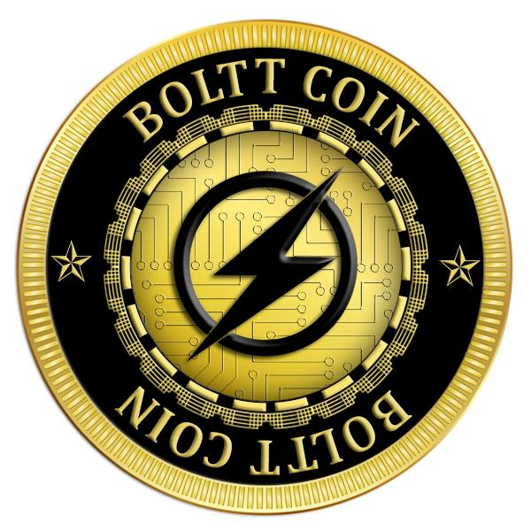

# Boltt smart contract
* Standard : ERC20
* Name : BOLTT COIN
* Ticker : BOLTT
* Decimals : 8 (Dual blockchain supported)
* Emission : Standard
* Fiat dependency : No
* Tokens locked : Yes

* BolttToken - Token contract
* Block Swap functionlity
* Configurator - contract with main configuration for production

## Dual Blockchain (Block swap)
Boltt smart contract is offering a special feature where the tokens are available on two block chains Waves and Ethereum together and user can swap their tokens between the two blockchains seemlesly with the help of investors dashboard back and forth.

## How to manage contract
To start working with contract you should follow next steps:

Compile it in Remix with enamble optimization flag and compiler 0.4.19
Deploy bytecode with MyEtherWallet. Gas 5100000 (actually 5073514).
Call 'deploy' function on addres from (3). Gas 4000000 (actually 3979551).

* Wallets with ERC20 support
* MyEtherWallet - https://www.myetherwallet.com/
* Parity
* Mist/Ethereum wallet

*Investor must not use other wallets, coinmarkets or stocks. Can lose money.*

Token counts.
Maximum tokens can mint - 100 000 000 BOLTT.

* Main network configuration
* Minimal insvested limit : 0.01 ETH
* Founders tokens lock period : 90 days.

## Smart contract important segment description.
Boltt token uses ERC20 standards and we have some other function to perfectly and smoothly run crowdsale and deal with dual blockchain system, important functionality is described below.

### approve()
Approve _value amount tokens for the spender.

### increaseApproval()
Increase the amount of tokens that an owner allowed to a spender.

### decreaseApproval()
Decrease approve _value amount tokens for the spender.

### releaseTokenTransfer()
Set the contract that can call release and make the token transferable.

### setTransferAgent()
Owner can allow a particular address (a crowdsale contract) to transfer tokens despite the lock up period.

### upgrade()
Allow the token holder to upgrade some of their tokens to a new contract.

### setUpgradeAgent()
Set an upgrade agent that handles.

### transferOwnership()
Allows the current owner to transfer control of the contract to a newOwner.

### setTransferAgent
Set agent who can transfer during sale.

### tranasfer()
transder token to other account

### transferFrom()
Transfer tokens from other account based on decreaseApproval

### allowance
Check the approved tokens from the account

### balanceOf()
Check the balance of an account

### totalSupply()
Check the total supply of the tokens

### moveToWaves()
MoveToWaves function is functino we deal with our dual blockchain. This function is used to tranfer the tokens of the user from ethereum to waves blockchain.

### canUpgrade()
Allow upgrade agent functionality kick in only if the crowdsale was success.

BolttCoin

BolttCoin is an trade-locked mintable token that has functionality to be upgraded and be used in multiple sale rounds.
Usage
Deploying

This works best if you are using two addresses, one deploy_addr and the other team_addr. Ideally, team_addr is a multisig wallet.

Initiate the token function with name and symbol set to ""; initialSupply set to 0; decimals as required; and mintable to "true" using deploy_addr as owner.

Then, call:

    setTransferAgent(deploy_addr, True) and setTransferAgent(team_addr, True) from deploy_addr to allow internal token transfers
    setMintAgent(team_addr, True) to allow team multisig to mint tokens (optional)
    setReleaseAgent(deploy_addr) to allow deploy_addr to enable trading, manually, on a future date
    setUpgradeMaster(team_addr) to provide upgrade authority to team address

On successful launch & testing, call setTokenInformation("BolttCoin", "BOLTT") to update ERC20 values.
Ownership

BolttCoin is an Ownable token, using transferOwnership the contract Ownership can be transferred to a safe executive wallet.
Token Sale Rounds

Using the approve function with setTransferAgent and setMintAgent mechanisms, set your crowdsale addresses to allow minting & transferring of tokens. This permits infinite crowdsale rounds.

Future sale contracts must work with independently supplied token address, specified via sale constructor.
